# omnia

A Clojure REPL for prototyping, experimenting and trying things out. <br />

Omnia is a REPL with almost all the power of a fully fledged editor, without being an editor.

## Installation
*Note: Omnia is currently in the BETA phase, so it may have some hiccups*

##### Only MacOS and Linux are currently directly supported and tested

### General

* Download the latest archived release: <br />
[Releases](https://github.com/AvramRobert/omnia/releases)

* Extract the `.tar` file

* Make the `omnia` file inside executable

* Run

### Arch Linux

Download it from the AUR:

    yaourt -S omnia


## Features

#### Expression editing
 * Manipulate s-exprs similar to paredit

 

#### Multi-line input
 * Input, edit and structure code in multiple lines

 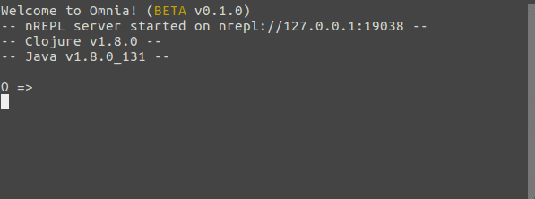
 
#### Multi-page input
 * There is no bottom, so you can exceed the view whilst being able to navigate back and forth

 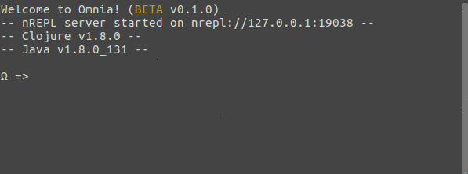

#### Editor-like input suggestions
 * Receive input suggestions and select from a truncated list

 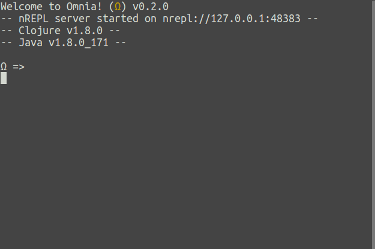

#### Editor-like selection system
 * Select code forward, backward up and down
 * Selected code can be cut, copied, deleted or overwritten

 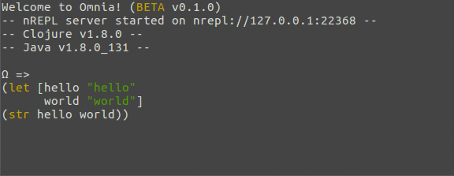

#### Expanding selection
 * Select code by means of expansion
 * Expand incrementally from nothing to words, to inner expressions, to outer expressions

 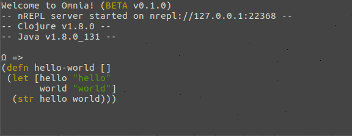
 
#### Copy/Cut/Paste
 * Copy/cut selections of input
 * Paste copied or cut code wherever in the input

**Note:** Only supported from within the REPL. Copying/cutting from external sources
and then pasting inside the REPL is not *currently* directly supported.

 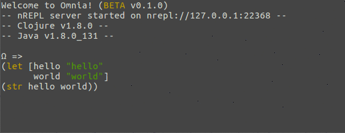

#### Code formatting
 * Format the current input code *by need*
 * Automatic formatting not yet supported

 

#### Parens matching
 * Match parenthesis *by need* when the cursor is next to one
 * Automatic parens matching not yet supported

 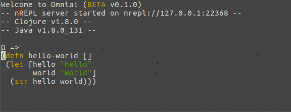

#### Scrolling
 * Scroll up and down the view arbitrarily
 * No mouse support for scrolling as of yet

 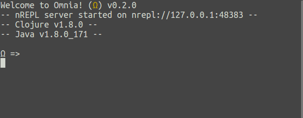

#### Persistent REPL history
 * Evaluations from previous REPL sessions are stored on disk
 * Histories have a limit of 1000 evaluations

 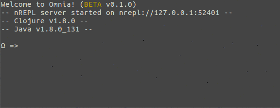

#### Dependency resolution
 * Bind external libraries at runtime and use them in the REPL
 * Use the `retrieve` function and pass the desired dependency
 * `retreive` currently only supports `clojars` and `mavencentral`

 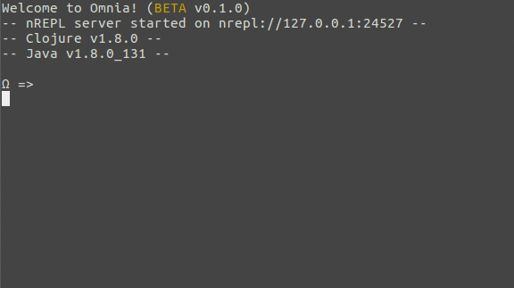
 
 * Other repositories are supported through `retrieve-from` by explicitly specifying them:
 ```clojure
 (retrieve-from {"sonatype" "https://oss.sonatype.org/content/repositories/releases/"}
                '[joda-time/joda-time "2.9.9"])
 ```
 
#### Configurable syntax highlighting
 * For configuration please look at the *Configuration* section.

 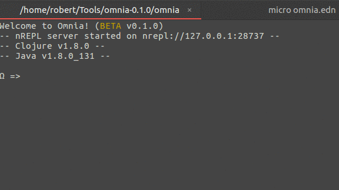

#### Configurable keybindings
 * The keybindings for all actions omnia supports can be configured

Please look at the *Configuration* section for more information.

#### Graceful failures
 * Should omnia crash for reasons unknown, the REPL will shut down with an appropriate
   message and log the stack trace of the error in a file called `.omnia.error`
 * The stack trace log can be found in the directory where the omnia executable is

## Configuration

Each Omnia release comes with a configuration file called `omnia.edn`, wherein
one can configure things like keybindings, syntax highlighting and toggling of features.

### Syntax highlighting

Currently supported colours:
 * :black
 * :white
 * :red
 * :blue
 * :yellow
 * :cyan
 * :magenta
 * :green
 * :default (transparent)

#### Default colourscheme

|Construct | Colour | Config parameter |
|----------|--------|------------------|
|Function calls | :yellow | :function |
|Numbers | :blue | :number |
|Strings | :green | :string |
|Chars | :green | :char |
|Keywords | :cyan | :keyword |
|Comments | :magenta | :comment |
|Lists | :white | :list |
|Vectors | :white | :vector |
|Maps | :white | :map |
|Special words | :yellow | :word |
|Text | :white | :text |
|Selections | :blue | :selection |

**NOTE** Multi-line string highlighting is not supported.

### Keybindings

**MacOS users**: Some of the default keybindings may not work directly, because MacOS attributes higher
priority to keys that do UI things and thus cannot be rebinded to something else.
Please just bind those actions to other keys.

#### Default keymap
| Operation    | Keybind        | Description | Config parameter|
|--------------|----------------|-------------|-----------------|
|Input char| any character key | Inserts character | - |
|Move up/down/left/right | Arrows UP/DOWN/LEFT/RIGHT | Moves the cursor | :up, :down, :left, :right |
|Newline | ENTER | Jumps to the next line | :newline |
|Backspace | BACKSPACE | Deletes character to the left or removes selected input | :backspace |
|Delete | DELETE | Deletes character to the right or removes selected input | :delete |
|Evaluate| ALT + E | Evaluates the input | :eval |
|Clear | CTRL + R | Clears screen of previous evaluations | :clear |
|Format| CTRL + ALT + L | Formats input | :format |
|Match | CTRL + P | Highlights the parens matching the current one | :match |
|Suggest | TAB            | Displays a list of possible inputs. Inputs can be selected by repeatedly pressing the key | :suggest |
|Jump | CTRL + LEFT/RIGHT | Jumps over words and spaces | :jump-left, :jump-right |
|Select | SHIFT + LEFT/RIGHT/UP/DOWN | Selects input in the direction specified by the arrow | :select-up, :select-down, :select-left, :select-right |
|Expand select| CTRL + W | Selects by gradually expanding from words to expressions | :expand |
|Jump select | CTRL + SHIFT + LEFT/RIGHT | Selects the words and spaces it jumps over | :jump-select-left, jump-select-right |
|Copy | ALT + C | Copies the current selection | :copy |
|Cut  | ALT + X | Cuts the current selection | :cut |
|Paste | ALT + P | Pastes the cut/copied selection | :paste |
|Select all | CTRL + A | Selects the whole input | :select-all |
|Scroll up  | PAGE-UP | Scrolls up the view | :scroll-up |
|Scroll down | PAGE-DOWN | Scrolls down the view | :scroll-down |
|Previous evaluation | ALT + UP | Goes to the previous evaluation in the history | :prev-eval |
|Next evaluation | ALT + DOWN | Goes to the following evaluation in the history | :next-eval |
|Exit | CTRL + D | Exits the REPL | :exit |
|Force quit | CTRL + C | Forcibly terminates the REPL | - |

### Configuring the keymap

**NOTE**: The syntax for configuring keybindings may change in the future.

Each operation omnia supports is bound to a unique key or combination of keys. 
Every keybind is defined as a map similar to the following: <br />

```clojure
{ :key   <key> 
  :ctrl  <boolean> 
  :alt   <boolean> 
  :shift <boolean> }
```

The :key field represents the actual key being pressed. For simple character keys, 
the value of that field should just be the normal Clojure character version of that key. <br />
For example, if I want for something to happen when I press "c": <br />

```clojure
{ :key   \c 
  :ctrl  false 
  :alt   false 
  :shift false }
```

For more esoteric keys, like "enter", "space", "tab" etc, the keyword version of the name of that specific 
key is required. <br />
For example, if I want for something to happen when I press "enter": <br />

```clojure
{:key   :enter 
 :ctrl  false 
 :alt   false 
 :shift false}
```

Any key combination with "ctrl", "alt" and/or "shift" is done by setting the value of "ctrl", "alt" and/or "shift"
to "true" in that map. <br />
For example, if I want for something to happen when I press "alt" and "e": <br /> 

```clojure
{:key   \e 
 :ctrl  false 
 :alt   true 
 :shift false }
```

Lastly, you need only specify "ctrl", "alt" and "shift" when you want to turn them *on*.
By default, they are always set to "false". That means, that <br />

```clojure
{:key   :enter
 :ctrl  false 
 :shift false 
 :alt   false}
```
is equivalent to
```clojure
{:key :enter}
```

#### Supported keys
**NOTE**: Please keep in mind that all the character keys, ENTER, SPACE, BACKSPACE, DELETE
and the arrow keys are used for actual input. I would advise not reserving them for other operations. <br />
Combinations of key + ctrl/alt/shift are however open. 
 
 * All character keys
 * The arrows: :left, :right, :up, :down
 * :enter
 * :space
 * :backspace
 * :tab
 * :page-up, :page-down
 * :escape
 * :home
 * :end
 * :insert
 * :delete
 * :f1 through :f19

#### Unsupported key combinations
Due to some issues with the terminal library omnia uses, some key combinations do not currently work:

 * CTRL + ENTER
 * CTRL + UP
 * CTRL + DOWN
 * CTRL + BACKSPACE

There are also some issues with the *command* key on MacOS.
Should you discover additional issues, please feel free to report them so I can add them to the list.
Solutions for this issue are currently being investigated.

### Bugs

Bug reports can be submitted as issues here on github.

**Note**: The REPL has a built-in failure-handling system and spits 
out a stack-trace dump when it crashes. 
Should it, for some reason, crash for you, then in the same directory
where the `omnia` executable is, you shall find a file named
`.omnia.error` containing the said stack-trace dump. <br />
Should you decide to report the crash, I would very much appreciate if you would, 
together with a short description of the actions performed before the crash, also
attach the contents of that file to your issue.

### Feature requests
Feature requests can be submitted as issues with the label `feature`. <br />
I would however like for every feature request to have a short description of its use case.
Their implementation priority will be determined in terms of their complexity and
said use case.

Pull requests are also very welcome!

### Things to look forward to
Omnia is under constant development, enhancement and improvement.
Incoming features in (not necessarily) chronological order:

 * Undo/redo support
 * Slurping / barfing expressions
 * Arity lookup
 * Clojure documentation lookup
 * Validation improvements for user config
 * Config improvements
 * Copying/cutting/pasting from external sources
 * Automatic parens matching
 * Automatic code formatting
 * More code documentation
 * Performance improvements
 * ..

## License

Copyright © 2017 Robert Marius Avram

Distributed under the Apache-2.0 License.
