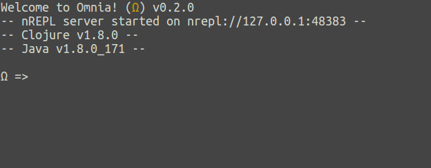
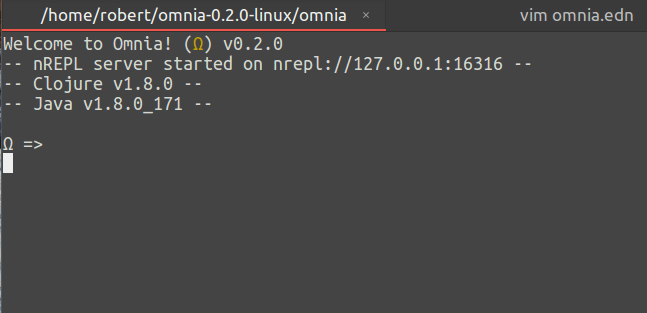
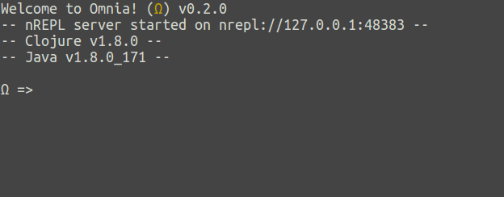
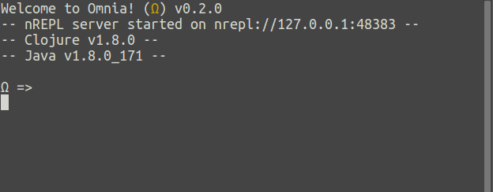
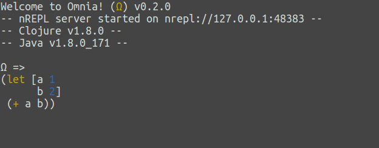
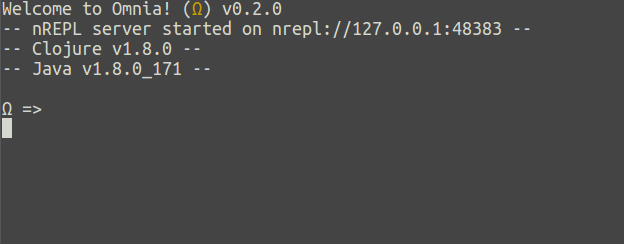
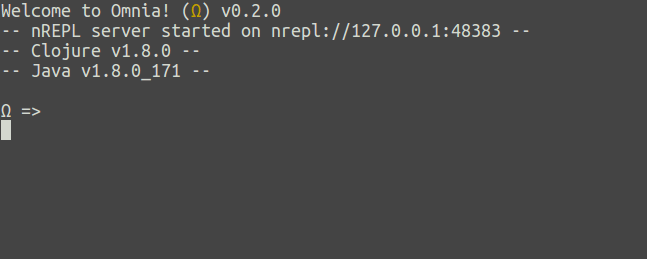
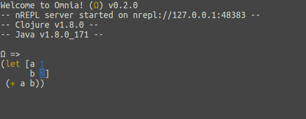
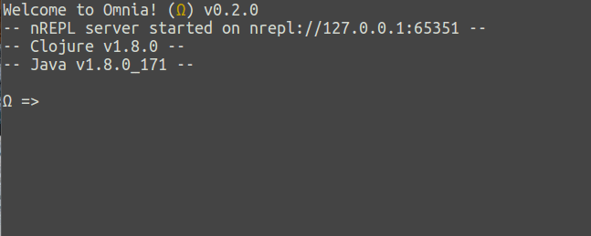

#  mnia

A Clojure REPL for prototyping, experimenting and trying things out. <br />

Omnia is a REPL with almost all the power of a fully fledged editor, without being an editor.

## Installation
### General

* Download the latest archived release: <br />
[Releases](https://github.com/AvramRobert/omnia/releases)

* Extract the `.tar` file

* Make the `omnia` file inside executable

* Run

### Arch Linux

Download it from the AUR:

    yaourt -S omnia
    
## Features

#### Configurable Keymap
 * Standard keymap can be found here [Keymap](https://github.com/AvramRobert/omnia/blob/master/doc/keymap.md)
 * For configuration,take a look at [Configuration](https://github.com/AvramRobert/omnia/blob/master/doc/configuration.md) 

#### Configurable syntax highlighting
 * For configuration please look at [Configuration](https://github.com/AvramRobert/omnia/blob/master/doc/configuration.md).

 
 
 

#### Structural editing
 * Manipulate s-exprs in a paredit-like fashion

 

#### Multi-line input
 * Input, edit and structure code in multiple lines

 
 
#### Multi-view input
 * The view has no bottom, so you can exceed it whilst being able to navigate back and forth

 


#### Automatic parens matching
 * Always know in which expression you are:
 
 

#### Code formatting
 * Format the current input code *by need*
 * Automatic formatting not yet supported

 

#### Input suggestions with autocompletion
 * Receive input suggestions and select from a truncated list

 

#### Signature lookup
 * Look up the signature of a function
 
 
 
#### Documentation lookup
 * Look up the documentation of a function and scroll through it
 
 

#### Selection system
 * Select code forward, backward up and down
 * Selected code can be cut, copied, deleted or overwritten

 

#### Selection expansion
 * Select code by means of incremental expansion

 
 
#### Copy/Cut/Paste
 * Copy/cut selections of input
 * Paste copied or cut code wherever in the input

**Note:** Only supported from within the REPL. Copying/cutting from external sources
and then pasting inside the REPL is not *currently* directly supported.

 

#### Undo/Redo
 * Undo actions and redo undoes
 
 

#### Scrolling
 * Scroll up and down the view arbitrarily
 * No mouse support for scrolling as of yet

 
 
#### Output clearing
 * Clear the output history
 
 

#### Dependency resolution
 * Bind external libraries at runtime and use them in the REPL
 * Use the `retrieve` function and pass the desired dependency
 * `retreive` currently only supports `clojars` and `mavencentral`

 
 
 * Other repositories are supported through `retrieve-from` by explicitly specifying them:
 ```clojure
 (retrieve-from {"sonatype" "https://oss.sonatype.org/content/repositories/releases/"}
                '[joda-time/joda-time "2.9.9"])
 ```
 
#### Persistent REPL history
 * Evaluations from previous REPL sessions are stored on disk
 * Histories have a limit of 1000 evaluations

 
 
#### Graceful failures
 * Should omnia crash for reasons unknown, the REPL will shut down with an appropriate
   message and log the stack trace of the error in a file called `.omnia.error`
 * The stack trace log can be found in the directory where the omnia executable is

### Bugs

Bug reports can be submitted as issues here on github.

**Note**: The REPL has a built-in failure-handling system and spits 
out a stack-trace dump when it crashes. 
Should it, for some reason, crash for you, then in the same directory
where the `omnia` executable is, you shall find a file named
`.omnia.error` containing the said stack-trace dump. <br />
Should you decide to report the crash, I would very much appreciate if you would, 
together with a short description of the actions performed before the crash, also
attach the contents of that file to your issue.

### Feature requests
Feature requests can be submitted as issues with the label `feature`. <br />
I would however like for every feature request to have a short description of its use case.
Their implementation priority will be determined in terms of their complexity and
said use case.

Pull requests are also very welcome!

### Things to look forward to
Omnia is under constant development, enhancement and improvement.
Incoming features in (not necessarily) chronological order:

 * Slurping / barfing expressions
 * REPL content manipulation
 * Automatic code formatting
 * Additional performance improvements
 * Better exception printing
 * ..

### Rationale

 Omnia is a stand-alone REPL. You can think of it as a better `lein repl`.
 It doesn't however have any support for interactive development with existing Clojure projects.
 It was actually never meant to be used for interactive development or to be integrated with
 any kind of editors. The rationale behind it is just to provide a better sandbox for experimenting with ideas,
 that needn't necessarily be part of some project.
 Hence its description: "A Clojure REPL for prototyping, experimenting and trying things out."

 I've given a lightning talk about it and its rationale, should you want to find out more about it. <br />
 The talk starts roughly at 1:05: https://www.youtube.com/watch?v=qdeU-2eoEIY

 Now the big question. What about `rebel-readline`?
 I've been asked this question too many times to count. <br />
 Well, purely historically, `omnia` came into existence much sooner than `rebel-readline`.
 I've started the project around the beginning of 2017 and also open-sourced its first
 draft in November of that year. <br />

 Nevertheless, both projects although similar, differ quite heavily in intent.
 `omnia`'s goal is to be a specialised, stand-alone REPL for Clojure.
 It will thus be focused on Clojure and it will try to provide the best experience
 just for Clojure itself. `rebel-readline`, as far as the description goes, is a more
 general-purpose terminal library for building REPLs targeting Clojure dialects.

 The way I think of it is like this: `omnia` is simply a tool. `rebel-readline` is a mechanism
 to build tools akin to `omnia`.

## License

Copyright © 2017-2018 Robert Marius Avram

Distributed under the Apache-2.0 License.