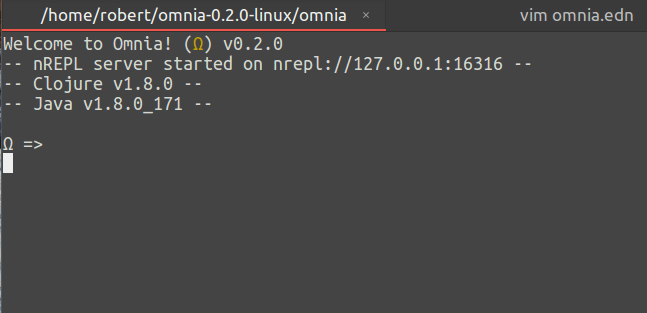

#### Configurable Keymap
* Standard keymap can be found here [Keymap](https://github.com/AvramRobert/omnia/blob/master/docs/keymap.md)
* For configuration,take a look at [Configuration](https://github.com/AvramRobert/omnia/blob/master/docs/configuration.md)

#### Configurable syntax highlighting
* For configuration please look at [Configuration](https://github.com/AvramRobert/omnia/blob/master/docs/configuration.md).




#### Structural editing
* Manipulate s-exprs in a paredit-like fashion


#### Multi-line input
* Input, edit and structure code in multiple lines


#### Multi-view input
* The view has no bottom, so you can exceed it whilst being able to navigate back and forth


#### Automatic parens matching
* Always know in which expression you are:


#### Code formatting
* Format the current input code *by need*
* Automatic formatting not yet supported


#### Input suggestions with autocompletion
* Receive input suggestions and select from a truncated list


#### Signature lookup
* Look up the signature of a function


#### Documentation lookup
* Look up the documentation of a function and scroll through it


#### Selection system
* Select code forward, backward up and down
* Selected code can be cut, copied, deleted or overwritten


#### Selection expansion
* Select code by means of incremental expansion


#### Copy/Cut/Paste
* Copy/cut selections of input
* Paste copied or cut code wherever in the input

**Note:** Only supported from within the REPL. Copying/cutting from external sources
and then pasting inside the REPL is not *currently* directly supported.


#### Undo/Redo
* Undo actions and redo undoes


#### Scrolling
* Scroll up and down the view arbitrarily
* No mouse support for scrolling as of yet


#### Output clearing
* Clear the output history


#### Dependency resolution
* Bind external libraries at runtime and use them in the REPL
* Use the `retrieve` function and pass the desired dependency
* `retreive` currently only supports `clojars` and `mavencentral`


* Other repositories are supported through `retrieve-from` by explicitly specifying them:
 ```clojure
 (retrieve-from {"sonatype" "https://oss.sonatype.org/content/repositories/releases/"}
                '[joda-time/joda-time "2.9.9"])
 ```

#### Persistent REPL history
* Evaluations from previous REPL sessions are stored on disk
* Histories have a limit of 1000 evaluations


#### Graceful failures
* Should omnia crash for reasons unknown, the REPL will shut down with an appropriate
  message and log the stack trace of the error in a file called `.omnia.error`
* The stack trace log can be found in the directory where the omnia executable is