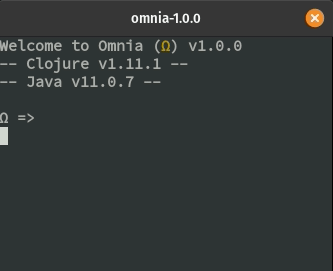
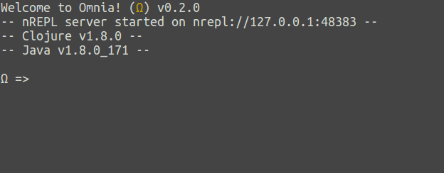
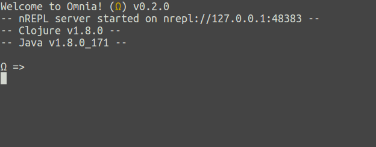
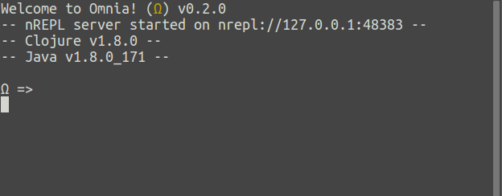
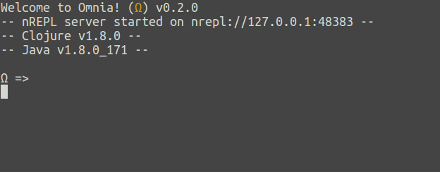
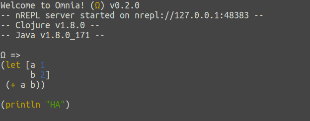
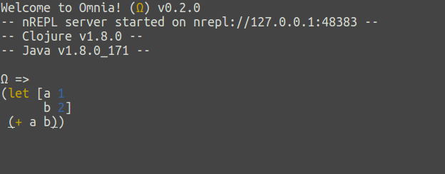
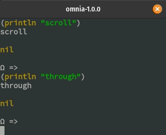
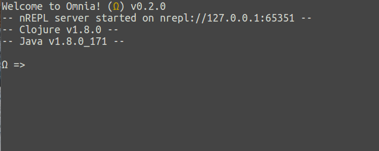

## Configurable Key Bindings
* Documentation found at [here](configuration.md#key-bindings)

## Configurable syntax highlighting
* Documentation found at [here](configuration.md#syntax-highlighting)



## Structural editing
* Barf and Slurp not supported



## Multi-line input



## Multi-view input




## Automatic parens matching


## On-demand code formatting



## Input suggestions with autocompletion


## Signature lookup


## Documentation lookup


## Selection system


## Selection expansion



## Copy/Cut/Paste



## Undo/Redo


## Scrolling
* Mouse scrolling not supported



## Output clearing


## Dependency resolution
* Other repositories are supported through `retrieve-from` by explicitly specifying them:
 ```clojure
 (retrieve-from {"sonatype" "https://oss.sonatype.org/content/repositories/releases/"}
                '[joda-time/joda-time "2.9.9"])
 ```


## Persistent REPL history

