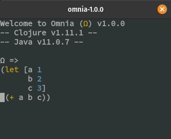

## Persistent REPL history

* Documentation found [here](configuration.md#history)

## Configurable Key Bindings
* Documentation found [here](configuration.md#key-bindings)

## Configurable syntax highlighting
* Documentation found [here](configuration.md#syntax-highlighting)


## Structural editing
* Barf and Slurp not supported


## Multi-line input


## Multi-view input


## Automatic parens matching


## On-demand code formatting


## Input suggestions with autocompletion


## Signature lookup


## Documentation lookup


## Selection system


## Selection expansion


## Copy/Cut/Paste


## Undo/Redo


## Scrolling
* Mouse scrolling not supported


## Output clearing


## Dependency resolution
* Other repositories are supported through `retrieve-from` by explicitly specifying them:
 ```clojure
 (retrieve-from {"sonatype" "https://oss.sonatype.org/content/repositories/releases/"}
                '[joda-time/joda-time "2.9.9"])
 ```


